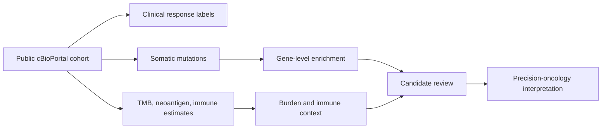

# Precision Oncology: Immunotherapy Response Profiling

Reproducible clinical-genomic analysis of a public metastatic melanoma cohort treated with CTLA-4 blockade.

The project asks a practical precision-oncology question:

> Can public tumor genomic and immune-context data distinguish patients with durable clinical benefit from those with progressive disease after immune checkpoint blockade?

The answer is intentionally nuanced: the cohort supports an immunogenicity pattern involving higher mutation burden, neoantigen load, and immune-context signals in durable-benefit samples, but it does **not** support claiming a validated single-gene response biomarker from this analysis alone.

## Why This Project Matters

Precision oncology is not just variant annotation. A useful translational analysis has to connect molecular features to a clinical question while protecting against artifacts.

This project demonstrates that workflow on a real public cohort:

- clinical endpoint definition
- public cohort ingestion through cBioPortal
- somatic mutation recurrence analysis
- response-enrichment testing
- multiple-testing correction
- low-frequency mutation triage
- tumor mutational burden and neoantigen context
- immune microenvironment estimates
- cautious biological interpretation



## Cohort

- Study: **Metastatic Melanoma (DFCI, Science 2015)**
- cBioPortal ID: `skcm_dfci_2015`
- Citation: Van Allen et al., Science 2015
- PMID: `26359337`
- Data portal: https://www.cbioportal.org/study/summary?id=skcm_dfci_2015
- Treatment context: CTLA-4 blockade
- Sequenced samples reported by cBioPortal: 110

## Headline Findings

The pipeline regenerated the analysis from public cBioPortal API data.

- Binary response analysis samples: 105
- Durable clinical benefit: 29
- No durable benefit: 76
- Indeterminate response labels excluded: 5
- Mutation records fetched: 53,013
- No gene-level association passed FDR <= 0.10
- Durable-benefit samples had higher median mutation count, nonsynonymous TMB, and neoantigen load
- RNA-derived immune estimates were available in a subset and trended toward higher CD8 T-cell and activated lymphocyte context in durable-benefit samples

The strongest conclusion is not "gene X predicts response." The stronger conclusion is that a review-grade analysis should evaluate gene signals in the context of tumor immunogenicity, sparse events, and multiple testing.

## Results

Main report:

- [Precision Oncology Report](results/precision_oncology_report.md)

Key tables:

- [Gene response enrichment](results/tables/gene_response_enrichment.csv)
- [Top recurrent genes](results/tables/top_recurrent_genes.csv)
- [Burden summary](results/tables/burden_summary.csv)
- [Immune context summary](results/tables/immune_context_summary.csv)

Figures:


## Repository Layout

```text
.
├── README.md
├── docs/
│   ├── data_source.md
│   ├── interpretation_guide.md
│   └── methods.md
├── src/
│   └── analyze_van_allen_melanoma.py
├── data/
│   └── derived/
│       ├── cohort_summary.csv
│       └── nonsynonymous_mutations.csv
└── results/
    ├── precision_oncology_report.md
    ├── figures/
    └── tables/
```

## Run The Analysis

The core pipeline uses only the Python standard library.

```bash
python3 src/analyze_van_allen_melanoma.py
```

The script downloads public data from cBioPortal and regenerates:

- derived cohort and mutation tables
- response-enrichment results
- burden and immune-context summaries
- SVG figures
- Markdown report

## Biological Interpretation

The analysis is strongest when read as a translational profiling workflow:

- High mutation and neoantigen burden can increase the probability of immunogenic tumor recognition, but neither is deterministic.
- Gene-level mutation enrichment must be interpreted alongside event counts, FDR, and biology.
- Low-frequency mutations may be mechanistically interesting, but they are not stable enough to promote without validation.
- Immune-context estimates provide useful orthogonal support when they align with response and burden patterns.
- A single retrospective cohort should generate hypotheses, not clinical decision rules.

## Documentation

- [Data source](docs/data_source.md)
- [Methods](docs/methods.md)
- [Interpretation guide](docs/interpretation_guide.md)

## Caveats

- Retrospective public cohort.
- No external validation set included.
- Response grouping collapses heterogeneous clinical categories.
- Gene-level mutation presence does not prove functional impact.
- cBioPortal-derived values may differ from publication-specific preprocessing.
- No clinical actionability is claimed.

