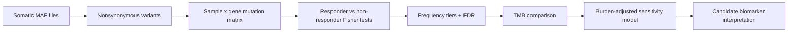

# Precision Oncology Mutation Enrichment

Exploratory WES/MAF analysis for identifying somatic mutation features associated with drug response.

This repository presents a compact precision-oncology case study: given tumor mutation calls and binary response annotations, build a defensible mutation-enrichment workflow that separates plausible biomarker signals from artifacts driven by sparse events, large genes, and tumor mutational burden.

## Executive Takeaway

The legacy rendered analysis in this repository reported `ERCC2` as the top response-associated candidate in a 50-sample cohort split evenly between responders and non-responders.

The updated workflow does **not** treat that as a validated biomarker. It reframes the result as a candidate association that must be evaluated against:

- event frequency and sparse-count instability
- multiple hypothesis testing
- large-gene recurrence artifacts
- tumor mutational burden as a possible confounder
- independent biological and clinical validation

That distinction is the point of the project: the analysis is designed to look like something an oncology bioinformatics team could review, challenge, and extend.

## Scientific Question

> Are any nonsynonymous somatic mutations enriched in responders compared with non-responders, and do those associations remain credible after accounting for mutation frequency, multiple testing, and mutation burden?

## Why This Matters

Small precision-oncology cohorts are common in translational settings. They are also statistically fragile. A mutation-response association can be distorted by:

- one or two low-frequency events
- genes that recur because they are large or mutable
- unequal tumor mutational burden across response groups
- variant-level counting instead of sample-level mutation presence
- unadjusted p-values across thousands of genes

This workflow makes those risks explicit.



## What Was Improved

The current analysis source in [analysis/precision_oncology_enrichment.Rmd](analysis/precision_oncology_enrichment.Rmd) implements a more reviewable workflow:

- sample-level gene mutation presence, rather than raw variant counts alone
- Fisher exact tests for small responder/non-responder contingency tables
- Benjamini-Hochberg q-values for multiple testing
- separate reporting for primary-screen, low-frequency, and singleton events
- corrected large-gene/FLAGS annotation logic
- nonparametric mutation-burden comparison
- logistic sensitivity model including mutation burden
- explicit assumptions, input checks, and cautious interpretation

## Current Legacy Result

The archived rendered output from the original assessment reported:

| Quantity | Reported value |
|---|---:|
| Samples | 50 |
| Responders | 25 |
| Non-responders | 25 |
| Top candidate | `ERCC2` |
| `ERCC2` mutant samples | 9 |
| `ERCC2` wild-type samples | 41 |
| Mean nonsynonymous mutations/Mb, `ERCC2` mutant | 10.67 |
| Mean nonsynonymous mutations/Mb, `ERCC2` wild-type | 5.05 |

Interpretation: `ERCC2` is biologically plausible because nucleotide excision repair alterations can affect DNA damage biology and mutation burden. In this cohort, however, the result should be treated as hypothesis-generating until it is reproduced with the updated workflow and validated externally.

## Repository Layout

```text
.
├── README.md
├── analysis/
│   └── precision_oncology_enrichment.Rmd
└── archive/
    └── legacy-output/
        ├── Knitted_Report.html
        └── README.pdf
```

The assessment data are not committed. The analysis expects:

```text
vanallen-assessment/
├── mafs/
│   └── *.maf
└── sample-information.tsv
```

Required clinical columns:

- `Tumor_Sample_Barcode`
- `Response`
- `Nonsynonymous_mutations_per_Mb`

Required MAF columns:

- `Hugo_Symbol`
- `Tumor_Sample_Barcode`
- `Variant_Classification`

## Reproduce The Analysis

Install R package dependencies:

```r
install.packages(c(
  "dplyr",
  "forcats",
  "ggplot2",
  "here",
  "knitr",
  "purrr",
  "readr",
  "rmarkdown",
  "stringr",
  "tibble",
  "tidyr"
))
```

Render the analysis:

```r
rmarkdown::render("analysis/precision_oncology_enrichment.Rmd")
```

## Reviewer Notes

This repository intentionally avoids claiming clinical actionability. A response-enriched mutation in a small cohort is a starting point for biological review, not a decision rule.

The most important reviewer questions are:

- Does the association survive multiple-testing correction?
- Is the signal driven by low-frequency events?
- Is the candidate associated with higher tumor mutational burden?
- Does the direction of effect remain plausible after burden adjustment?
- Is there external evidence connecting the gene to drug mechanism, DNA repair, immune response, or tumor biology?

## Status

The source workflow has been cleaned and syntax-checked. Final recomputation requires the original assessment data, which are intentionally excluded from the public repository.

