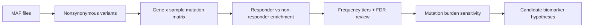

# Precision Oncology Mutation Enrichment

Exploratory whole-exome/MAF analysis of somatic mutations associated with drug response. The project was originally completed as a compact coding assessment and has been reframed as a clean, reviewable precision-oncology workflow.

## Executive Summary

This analysis evaluates whether nonsynonymous somatic mutations are enriched in responders versus non-responders. The original knitted report analyzed 50 samples split evenly between responders and non-responders and reported `ERCC2` as the most enriched candidate gene.

The updated workflow treats that result as **hypothesis-generating**, not definitive. It adds safeguards expected in an oncology genomics review:

- corrected large-gene/FLAGS reporting
- gene-level Fisher exact tests for small cohorts
- multiple-testing correction
- explicit low-frequency mutation handling
- mutation burden comparison using robust statistics
- sensitivity modeling for mutation burden as a potential confounder
- clear assumptions and data requirements

## Why This Matters

In precision oncology, a mutation-response association is only useful if the analysis separates signal from artifacts. Small cohorts, sparse mutation events, highly mutated tumors, and large recurrently mutated genes can all produce misleading findings.

This repository shows how to approach a small WES/MAF response-enrichment problem with appropriate caution:



## Current Result From The Existing Knitted Report

The committed knitted report previously produced these headline observations:

- 50 samples: 25 responders and 25 non-responders
- top recurrently mutated genes included `TTN`, `TP53`, `MUC16`, `ERBB4`, `KMT2D`, `ERBB3`, `RB1`, `ERCC2`, and `PIK3CA`
- `ERCC2` was reported as the most significantly enriched gene
- `ERCC2` mutant samples: 9
- `ERCC2` wild-type samples: 41
- reported mean nonsynonymous mutations per Mb:
  - `ERCC2` mutant: 10.67
  - `ERCC2` wild-type: 5.05

These observations need to be interpreted carefully because mutation burden may be related to both DNA repair biology and response. The updated source analysis explicitly checks this issue.

## Important Corrections

The original script contained a FLAGS reporting bug:

```r
top15[flags %in% top15]
```

That expression indexes the top-15 gene vector using a logical vector derived from the FLAGS list. The corrected logic is:

```r
intersect(top15, flags)
```

This matters because genes such as `TP53` and `KMT2D` should not be reported as FLAGS based on the FLAGS list used in the script.

The updated analysis also avoids treating nominal low-frequency hits as validated biomarkers. Genes mutated in only one or two samples can be interesting, but they require separate reporting and external validation.

## Repository Contents

- `Raw_Code.Rmd`: updated, reviewable R Markdown analysis workflow
- `Knitted_Report.html`: legacy knitted report from the original assessment
- `README.pdf`: legacy PDF output from the original assessment

The data are not committed to this repository. The workflow expects:

```text
vanallen-assessment/
  mafs/
    *.maf
  sample-information.tsv
```

## Reproducibility

Install the required R packages:

```r
install.packages(c(
  "dplyr",
  "forcats",
  "ggplot2",
  "here",
  "knitr",
  "purrr",
  "readr",
  "rmarkdown",
  "stringr",
  "tibble",
  "tidyr"
))
```

Then knit:

```r
rmarkdown::render("Raw_Code.Rmd")
```

## Analysis Philosophy

This is the standard used in the updated workflow:

- Start from sample-level mutation presence, not raw variant count alone.
- Use Fisher exact tests for sparse mutation-response tables.
- Report multiple-testing-adjusted q-values.
- Separate primary-screen genes from low-frequency findings.
- Treat mutation burden as a possible confounder.
- Keep biological interpretation proportional to cohort size.

## Interpretation For Reviewers

The project demonstrates practical oncology bioinformatics judgment: it does not just produce a significant p-value, it asks whether that signal could be affected by sample size, low-frequency events, large genes, or tumor mutational burden.

`ERCC2` remains a biologically plausible candidate because DNA repair alterations can affect mutation burden and treatment sensitivity. However, this repository frames the finding appropriately: a candidate association that should be validated, not a standalone clinical biomarker claim.
