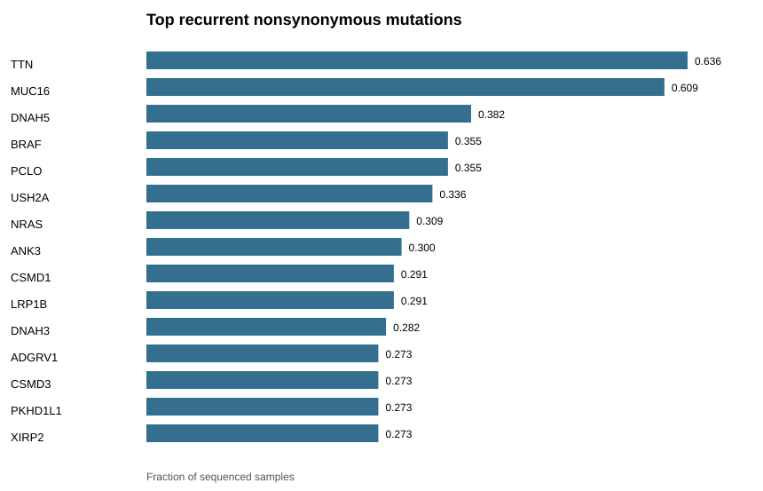
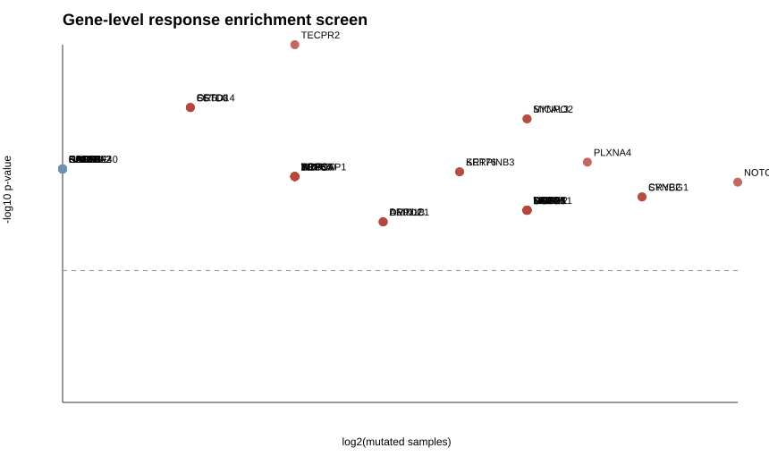
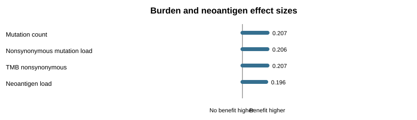
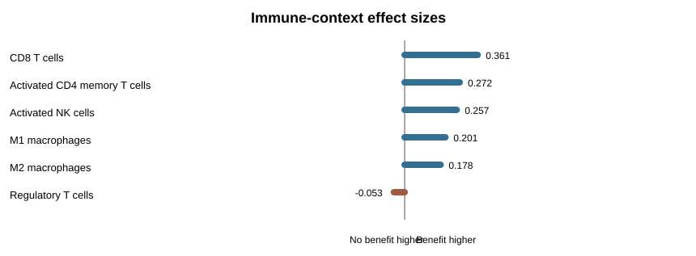

# Precision Oncology Report: CTLA-4 Blockade Melanoma Cohort

## Cohort

Public cohort: **Metastatic Melanoma (DFCI, Science 2015)**  
Citation: **Van Allen et al. Science 2015**  
PMID: **26359337**  
Sequenced samples reported by cBioPortal: **110**

This analysis uses public cBioPortal data from the Van Allen metastatic melanoma cohort. The biological question is whether somatic mutation features and tumor immune context distinguish patients with durable clinical benefit from those with progressive disease after immune checkpoint blockade.

## Response Definition

- Durable clinical benefit: `CR`, `PR`, or `SD`
- No durable benefit: `PD`
- Excluded from binary response analysis: `X` or missing/indeterminate labels

Analysis set:

- Durable clinical benefit: **29**
- No durable benefit: **76**
- Excluded indeterminate: **5**

## Why This Is A Precision Oncology Analysis

The analysis connects four clinically relevant layers:

1. Somatic mutation recurrence from WES.
2. Gene-level response enrichment.
3. Tumor mutational and neoantigen burden.
4. Immune-context estimates where available.

The goal is not to declare a clinical biomarker from one cohort. The goal is to identify biologically plausible, statistically transparent candidate signals that could be followed up in an independent validation set.

## Executive Interpretation

- No gene-level association passes FDR <= 0.10 in this exploratory screen.
- Several nominal gene-level signals are enriched in durable-benefit samples, but many are sparse and not established checkpoint-response biomarkers.
- Durable-benefit samples show higher median mutation count, nonsynonymous TMB, and neoantigen load.
- RNA-derived immune estimates are available in a subset and trend toward higher CD8 T-cell and activated lymphocyte context in durable-benefit samples.
- The most credible interpretation is a cohort-level immunogenicity pattern, not a validated single-gene predictor.

## Top Recurrently Mutated Genes

| gene | mutated_samples | sample_fraction | flag_gene | biology_panel |
| --- | --- | --- | --- | --- |
| TTN | 70 | 0.636 | True |  |
| MUC16 | 67 | 0.609 | True |  |
| DNAH5 | 42 | 0.382 | False |  |
| BRAF | 39 | 0.355 | False | Melanoma drivers |
| PCLO | 39 | 0.355 | False |  |
| USH2A | 37 | 0.336 | True |  |
| NRAS | 34 | 0.309 | False | Melanoma drivers |
| ANK3 | 33 | 0.300 | False |  |
| CSMD1 | 32 | 0.291 | False |  |
| LRP1B | 32 | 0.291 | False |  |
| DNAH3 | 31 | 0.282 | False |  |
| ADGRV1 | 30 | 0.273 | False |  |
| CSMD3 | 30 | 0.273 | False |  |
| PKHD1L1 | 30 | 0.273 | False |  |
| XIRP2 | 30 | 0.273 | False |  |

Large genes such as `TTN` and `MUC16` are retained in the table but flagged because recurrence may reflect gene length and mutability rather than treatment-specific biology.



## Gene-Level Response Enrichment

Primary-screen genes are mutated in at least 5 analyzed samples. Low-frequency findings are reported separately because sparse events can produce unstable odds ratios.

| gene | mutated_samples | dcb_mutated | no_dcb_mutated | odds_ratio_dcb | p_value | q_value | flag_gene | biology_panel |
| --- | --- | --- | --- | --- | --- | --- | --- | --- |
| TECPR2 | 6 | 6 | 0 | Inf | 0.0003 | 0.8124 | False |  |
| FSTL4 | 5 | 5 | 0 | Inf | 0.0012 | 0.8124 | False |  |
| OR5D14 | 5 | 5 | 0 | Inf | 0.0012 | 0.8124 | False |  |
| SETD3 | 5 | 5 | 0 | Inf | 0.0012 | 0.8124 | False |  |
| MICAL3 | 9 | 7 | 2 | 11.773 | 0.0016 | 0.8124 | False |  |
| SYNPO2 | 9 | 7 | 2 | 11.773 | 0.0016 | 0.8124 | False |  |
| PLXNA4 | 10 | 7 | 3 | 7.742 | 0.0043 | 0.8124 | False |  |
| KRT76 | 8 | 6 | 2 | 9.652 | 0.0053 | 0.8124 | False |  |
| SERPINB3 | 8 | 6 | 2 | 9.652 | 0.0053 | 0.8124 | False |  |
| ARSJ | 6 | 5 | 1 | 15.625 | 0.0059 | 0.8124 | False |  |

FDR-significant genes at q <= 0.10: **0**



## Low-Frequency Signals

These genes have nominal p-value < 0.05 but are mutated in only 2-4 samples. They may be biologically interesting, but they should not be promoted as biomarkers without external evidence.

| gene | mutated_samples | dcb_mutated | no_dcb_mutated | odds_ratio_dcb | p_value | q_value | biology_panel |
| --- | --- | --- | --- | --- | --- | --- | --- |
| C11ORF40 | 4 | 4 | 0 | Inf | 0.0050 | 0.8124 |  |
| CAGE1 | 4 | 4 | 0 | Inf | 0.0050 | 0.8124 |  |
| DDI1 | 4 | 4 | 0 | Inf | 0.0050 | 0.8124 |  |
| KAT6B | 4 | 4 | 0 | Inf | 0.0050 | 0.8124 |  |
| PARP8 | 4 | 4 | 0 | Inf | 0.0050 | 0.8124 |  |
| RAD54L2 | 4 | 4 | 0 | Inf | 0.0050 | 0.8124 |  |
| RB1CC1 | 4 | 4 | 0 | Inf | 0.0050 | 0.8124 |  |
| RBSN | 4 | 4 | 0 | Inf | 0.0050 | 0.8124 |  |
| SLC12A2 | 4 | 4 | 0 | Inf | 0.0050 | 0.8124 |  |
| ALKBH2 | 3 | 3 | 0 | Inf | 0.0195 | 0.8124 |  |
| ANKRD55 | 3 | 3 | 0 | Inf | 0.0195 | 0.8124 |  |
| ATP9B | 3 | 3 | 0 | Inf | 0.0195 | 0.8124 |  |
| ATXN2 | 3 | 3 | 0 | Inf | 0.0195 | 0.8124 |  |
| BAIAP2L1 | 3 | 3 | 0 | Inf | 0.0195 | 0.8124 |  |
| BAZ1B | 3 | 3 | 0 | Inf | 0.0195 | 0.8124 |  |

## Burden And Neoantigen Context

| feature | n_dcb | n_no_dcb | median_dcb | median_no_dcb | rank_biserial_dcb_vs_no_dcb |
| --- | --- | --- | --- | --- | --- |
| Mutation count | 29 | 76 | 314.000 | 217.500 | 0.207 |
| Nonsynonymous mutation load | 29 | 76 | 321.000 | 223.000 | 0.206 |
| TMB nonsynonymous | 29 | 76 | 10.500 | 7.300 | 0.207 |
| Neoantigen load | 29 | 76 | 238.000 | 122.500 | 0.196 |

Rank-biserial effect size is positive when values tend to be higher in durable-benefit samples and negative when values tend to be higher in no-benefit samples.



## Immune Context

Selected CIBERSORT/ESTIMATE-derived immune features available through cBioPortal:

| feature | n_dcb | n_no_dcb | median_dcb | median_no_dcb | rank_biserial_dcb_vs_no_dcb |
| --- | --- | --- | --- | --- | --- |
| CD8 T cells | 13 | 26 | 0.066 | 0.034 | 0.361 |
| Activated CD4 memory T cells | 13 | 26 | 0.033 | 0.008 | 0.272 |
| Activated NK cells | 13 | 26 | 0.007 | 0.000 | 0.257 |
| M1 macrophages | 13 | 26 | 0.023 | 0.017 | 0.201 |
| M2 macrophages | 13 | 26 | 0.080 | 0.063 | 0.178 |
| Regulatory T cells | 13 | 26 | 0.000 | 0.000 | -0.053 |
| Follicular helper T cells | 0 | 0 |  |  |  |



## Biology-Focused Candidate Review

Curated panel genes observed in the enrichment screen:

| gene | biology_panel | mutated_samples | dcb_mutated | no_dcb_mutated | odds_ratio_dcb | p_value | q_value |
| --- | --- | --- | --- | --- | --- | --- | --- |
| MAP2K1 | Melanoma drivers | 9 | 6 | 3 | 6.348 | 0.0127 | 0.8124 |
| PMS2 | DNA repair | 3 | 3 | 0 | Inf | 0.0195 | 0.8124 |
| POLD1 | DNA repair | 3 | 3 | 0 | Inf | 0.0195 | 0.8124 |
| TIGIT | Immune signaling | 3 | 3 | 0 | Inf | 0.0195 | 0.8124 |
| ERCC2 | DNA repair | 4 | 3 | 1 | 8.654 | 0.0631 | 0.8124 |
| RAC1 | Melanoma drivers | 3 | 2 | 1 | 5.556 | 0.1841 | 0.9750 |
| TP53 | Melanoma drivers | 15 | 2 | 13 | 0.359 | 0.2267 | 1.0000 |
| NF1 | Melanoma drivers | 18 | 7 | 11 | 1.880 | 0.2566 | 1.0000 |
| MSH2 | DNA repair | 4 | 2 | 2 | 2.741 | 0.3051 | 1.0000 |
| ATR | DNA repair | 12 | 5 | 7 | 2.054 | 0.3052 | 1.0000 |
| JAK1 | Immune signaling | 6 | 3 | 3 | 2.808 | 0.3434 | 1.0000 |
| BRAF | Melanoma drivers | 36 | 12 | 24 | 1.529 | 0.3655 | 1.0000 |
| PTEN | Melanoma drivers | 7 | 3 | 4 | 2.077 | 0.3919 | 1.0000 |
| HLA-B | Immune signaling | 8 | 1 | 7 | 0.352 | 0.4395 | 1.0000 |
| ERCC3 | DNA repair | 2 | 1 | 1 | 2.679 | 0.4780 | 1.0000 |
| HLA-A | Immune signaling | 2 | 1 | 1 | 2.679 | 0.4780 | 1.0000 |
| XPC | DNA repair | 2 | 1 | 1 | 2.679 | 0.4780 | 1.0000 |
| HLA-C | Immune signaling | 5 | 2 | 3 | 1.802 | 0.6147 | 1.0000 |
| POLE | DNA repair | 5 | 2 | 3 | 1.802 | 0.6147 | 1.0000 |
| NRAS | Melanoma drivers | 34 | 8 | 26 | 0.733 | 0.6425 | 1.0000 |

Interpretation should prioritize convergence across statistics and biology:

- DNA repair candidates can be linked to mutation burden, neoantigen load, and treatment sensitivity, but burden may also confound response association.
- Melanoma driver genes are important for disease biology but are not automatically response biomarkers.
- Antigen presentation and interferon pathway genes may be mechanistically relevant to checkpoint response, but low event counts require caution.

## Caveats

- The analysis is retrospective and exploratory.
- The binary response definition collapses heterogeneous clinical categories.
- Gene-level mutation presence does not distinguish driver, passenger, clonal, subclonal, loss-of-function, or gain-of-function effects.
- cBioPortal-derived fields may differ from publication-specific preprocessing.
- No external validation cohort is included here.
- No clinical actionability is claimed.

## Reproducibility

Run:

```bash
python3 src/analyze_van_allen_melanoma.py
```

The script downloads public cBioPortal data and regenerates the derived tables, figures, and this report.
